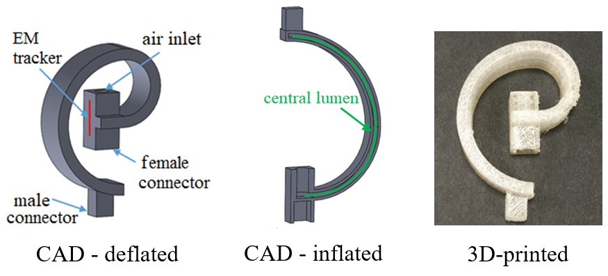
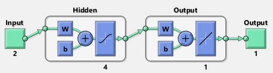
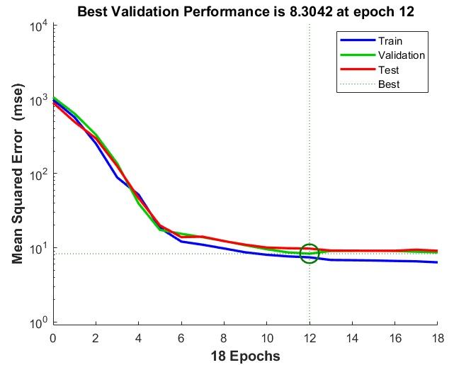

# Soft Robot Neural Network
This repository contains the Matlab files from a project I worked on during my PhD that aimed to model the behavior of a 3D-printed soft-robotic pneumatic actuator. This work was published in the International Journal of Computer Assisted Radiology and Surgery. See the full paper [here](http://web.hku.hk/~kwokkw/PDF/2018%20Modular%20force%20approximating%20soft%20robotic%20pneumatic%20actuator.pdf).

## Overview
The model takes as inputs the air pressure applied to actuate the soft robot as well as the load applied to deflect the soft robot. The target values are the displacement magnitudes resulting from the applied forces. 

  

## Model Architecture
The network architecture consists of two inputs (inflation pressure, load), a single hidden layer with four units, and an output layer with a single linear activation (displacement). The network was trained using the Levenberg–Marquardt algorithm and overfitting was prevented with early stopping (i.e. the validation error stopped improving).

  

## Performance
The performance of the model was evaluated using mean-squared-error between the output displacement values and the target displacement values.

  

